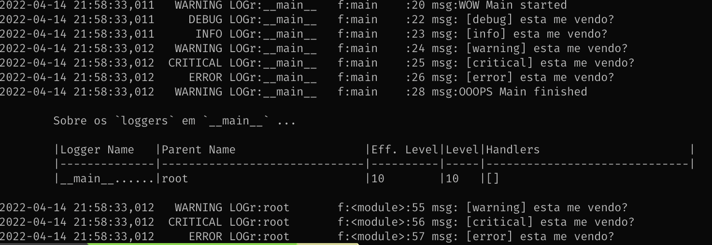

****************
python_log_tutor
****************

--------------------------------------------------------------------------------

[EN]:
    A small, simple and quite useful Python `logging` introduction.

    Comments and issues are welcome ;)

[pt-BR]:
    Uma pequna, simples e bastante útil introdução a Python `Logging`

    comentários e issues são bem vindas ;)

--------------------------------------------------------------------------------

"Logging" - O que é e porque?
=============================

Acompanhar a execução de um programa pode ser um tanto desafiador.

Seja por causa da complexidade da lógica e quantidade de variáveis,
ou talvez pela integração com outros sistemas,
pode ficar difícil entender o que de fato está acontecendo em uma parte do sistemas.

Também quando em produção, colher métricas de execução,
tempo de resposta, atividades de usuários tem uma variedade de coisas
acontecendo no sistema e muitas vezes sofrendo interferência de fora do sistema.
Para isso temos o famoso "log" ou sistemas de "logging" ou em bom português,
o registro.

A linguagem Python tem uma classe de objetos específica para auxiliar
no trabalho de registro de execução de um software,
e esta classe se chama **`Logger`**,
ou pode procurar por Python Logging Facility"

Pare de usar `print()`s , você merece, e está pronto!

de uma olhada no site da Necto, em www.necto.com.br_,  o artigo sobre Python "Logging"

.. _www.necto.com.br: http://www.necto.com.br

